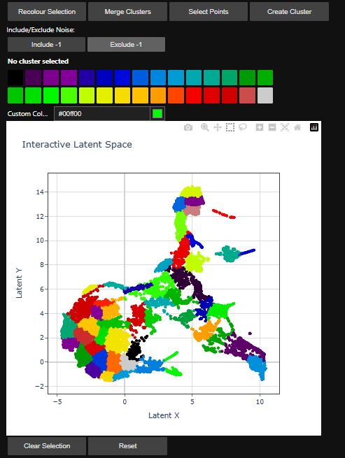

Tutorials
=========

.. _introduction_to_jupyter

Introduction to Jupyter
------------------------

Using SIGMA2 does not require any previous knowledge of python or jupyter notebooks. This section contains some tips and shortcuts to help users who are less experienced with python and jupyter to run SIGMA.

Opening a Notebook
^^^^^^^^^^^^^^^^^^

In your conda command line interface, you can start jupyter lab by running the following:

.. code-block:: bash

   jupyter lab

This should open a browser window with jupyter lab running. It should look like this.

.. image:: jupyter_interface.png
  :width: 400
  :alt: Browser window showing jupyter lab running

In the left hand panel, you can see a folder structure. In here you can navigate through folders on your computer, into a folder containing the notebook(s) you wish to run.

You can then open one of these notebooks by double clicking it. It should then open to the right of this panel containing the directories.

Running Cells
^^^^^^^^^^^^^

A jupyter notebook is made up of cells. An example is shown here.

.. image:: jupyter_example.png
  :width: 400
  :alt: Example of cells in jupyter

A jupyter notebook will typically contain

* Markdown cells. These usually contain text, which is intended to provide information / guidance to the user. They do not impact how the code is run in the notebook.
* Code cells. These contain code, which will be ran by the notebook
* Outputs. These appe

To run a cell, select it with your mouse and press ``Shift`` + ``Enter``. This will run the cell and advance to the next cell.

Useful Shortcuts
^^^^^^^^^^^^^^^^

Some useful shortcuts for running and using cells in jupyter are:

* ``Shift`` + ``Enter`` will run the current cell and advance to the next cell
* ``Ctrl`` or ``Cmd`` + ``Enter`` will run the current cell without advancing to the next cell
* ``Alt`` + ``Enter`` will run the current cell, and create a new cell beneath the current cell
* Typing part of the name of an object or function, then pressing ``Tab`` will autocomplete it
* After typing a function, pressing ``Shift`` + ``Tab`` will bring up the docstring for the function. This will contain brief information about what the function does, and what arguments it expects.

.. _interactive_sem_tutorial

Interactive SEM Tutorial
------------------------

Introduction
^^^^^^^^^^^^

This tutorial is designed to walk-through the key features of SIGMA2, and demonstrates the workflow that can be used to analyse EDS data with the tools provided.

In general, the philosopy behind the SIGMA workflow is:

#. Reduce the dimensionality of the dataset into a **latent space**.
#. Produce **clusters** by grouping points in the latent space together.
#. Perform Non-negative Matrix Factorisation **(NMF)** on these clusters to determine the constituent phases that make up the sample

Opening the Notebook
^^^^^^^^^^^^^^^^^^^^

Start jupyter lab by running the following in the ``sigma2`` environment in the ``conda`` terminal in the ``SIGMA2`` folder.

.. code-block:: bash

   jupyter lab

A browser window should open, with jupyter lab running. Navigate to the ``Interactive_SEM_tutorial.ipynb`` notebook in the tutorials folder, and open it. 

Importing the Required Packages
^^^^^^^^^^^^^^^^^^^^^^^^^^^^^^^

The first code cells of the notebook should look like:

.. code-block:: python 

   from umap import UMAP # for UMAP latent space projections
   import sys # for relative imports of sigma

.. code-block:: python 
   sys.path.insert(0,"..")
   from sigma.utils import normalisation as norm 
   from sigma.utils import visualisation as visual
   from sigma.utils.load import SEMDataset
   from sigma.src.utils import same_seeds
   from sigma.src.dim_reduction import Experiment
   from sigma.models.autoencoder import AutoEncoder
   from sigma.src.segmentation import PixelSegmenter
   from sigma.gui import gui

Running these cells will:

* Import the ``umap`` package which is needed to perform latent space projections
* Import the `sys` package -this is needed to perform "relative imports" of SIGMA2

.. note::
   SIGMA2 is still in development, so for the time being it is imported using relative imports. When you create your own notebooks for analysis, you will need to ensure the relative imports "point" to the correct place - see :doc:`personal` section for more information about using SIGMA for your own data analysis.

Loading a Dataset
^^^^^^^^^^^^^^^^^

To load a file into SIGMA, it should be loaded into the appropriate object.

* For SEM+EDS datasets, where a spectrum is available for each pixel, use the ``SEMDataset`` object
* For STEM+EDS datasets, use the ``TEMDataset`` object
* For datasets where only images of elemental maps exist, use the ``ImageDataset`` object - note that this object has more limited functionality. 

SIGMA2 supports loading from the following formats:

* Bruker Composite Format ``.bcf``
* ``.emi`` and ``.ser`` file pairs, created by FEI / ThermoFisher software
* ``.hspy`` files from Hyperspy
* ``.raw`` and ``.rpl`` files from Oxford Instruments 
* ``.h5oina`` files from Oxford Instruments

.. note::
   Certain formats, in particular the ``.raw`` and ``.rpl`` formats, may contain issues with calibration. See the tutorial notebook for these specific files to determine how to calibrate these files in SIGMA.

The example included in the dataset is a ``.bcf`` file from an SEM, so is loaded with the following cell:

.. code-block:: python 

   file_path = 'test.bcf'
   sem = SEMDataset(file_path)

We now have an ``SEMDataset`` object called ``sem`` which contains the EDS file. 

If you collected a dataset on a TEM, you will instead need to load it using the ``TEMDataset`` object, with:

.. code-block:: python

   file_path = 'tem_dataset.bcf' #replace this with the path to your tem file
   tem = TEMDataset(file_path)

Viewing the Dataset
^^^^^^^^^^^^^^^^^^^

The dataset can be viewed by running the following cell:

.. code-block:: python 

   gui.view_dataset(sem)

This cell may take some time to run, depending on the size of the dataset. Once this cell has finished running, a number will replace the ``[*]`` that appears next to the cell, and a Graphical User Interface (GUI) will appear beneath the cell. It should contain the following:

#. A text box, with the label "Energy (keV)". This can be used to search for X-Ray peaks of a given energy, if certain peaks are not already included in the metadata
#. A text box labelled "Feature List". For the ``test.bcf`` file, this box should already contain X-Ray lines, starting with "Al_Ka", though more can be added if desired.
#. A windowed GUI containing tabs labelled "Navigation Signal", "Sum Spectrum" and "Elemental Maps (raw)"

The firt tab in the gui show the navigation image. For the file used in this notebook, this is the Back Scattered Electron (BSE) image that is part of the ``test.bcf`` file.

The second tab shows the summed spectrum, the full EDS spectrum from all of the pixels in the dataset. The peaks defined in the feature list should me annotated on this plot

The third tab shows "raw" elemental map, found by integrating the peaks defined in the feature list from the centre of the peak to plus/minus the full width half maximum of the peak. The maps are "raw", as they are from the unbinned dataset.

Pre-Processing Steps
^^^^^^^^^^^^^^^^^^^^

The following cell performs some pre-processing steps to improve the projection into latent space. This involves:

#. Binning the data, reducing the total number of pixels and increasing the X-ray counts for each binned pixel
#. Normalising the data for each pixel, so that the integrated intensity is 1
#. Removing the intense zero energy peak

The degree of binning is defined by the ``rebin_signal((nx,ny))`` function, which will bin the dataset by factors of ``nx`` and ``ny`` in the x and y dimensions respectively.

The normalisation is performed with the ``peak_intensity_normalisation`` function.

The zero energy peak is removed by cropping the signal, the lower limit of this crop is defined in the ``remove_first_peak(lower_limit)`` function, where ``lower_limit`` defines the minimum energy, in keV, of the cropped spectrum.

These three steps are all performed in the single cell:

.. code-block:: python 

   # Rebin both edx and bse dataset
   sem.rebin_signal(size=(3,3))
   
   # normalisation to make the spectrum of each pixel summing to 1.
   sem.peak_intensity_normalisation()
   
   # Remove the first peak until the energy of 0.1 keV
   
   sem.remove_first_peak(end=0.1)
   

The binned dataset can be visualised by running the following cell again, and navigating to the "Elemental maps (binned)" tab.

.. code-block:: python 

   gui.view_dataset(sem)

In addition to normalising the EDS spectrum for each pixel, the "feature vectors" must also be normalised. The "feature vector" for a pixel is a vector, with a length defined by the number of X-Ray lines in "feature list". The intensity of each line in the feautre vector for a pixel is the integrated intensity of that peak.

These can be normalised using one or more of the following
* neighbour averaging
* Neighbour averaging, followed by the "z score" method (which scales based on the mean and standard deviation of the intensity - see https://en.wikipedia.org/wiki/Standard_score)
* Neighbour averaging, followed by "z score", followed by the "softmax" method (see https://en.wikipedia.org/wiki/Softmax_function) - this method is useful when there are small deviations in composition away from the mean.

The effect of each of these normalisation steps can be visualised by running this cell:

.. code-block:: python 

   gui.view_pixel_distributions(sem,norm_list=[norm.neighbour_averaging,norm.zscore,norm.softmax],cmap='Reds')

For this dataset, we will use the neighbour averaging and z score methods. We perform these on the dataset by running the following cell. If you choose to use a different set of normalisation parameters, uncomment the relevant line of code in the cell.

.. code-block:: python

   #sem.normalisation([norm.neighbour_averaging])
   sem.normalisation([norm.neighbour_averaging,norm.zscore])
   #sem.normalisation([norm.neighbour_averaging,norm.zscore,norm.softmax])

Now normalisation is complete, the intensity maps can be inspected again by running this cell:

.. code-block:: python
   print('After normalisation:')
   gui.view_intensity_maps(spectra=sem.normalised_elemental_data, element_list=sem.feature_list)

Optional - Adding the BSE intensity as a feature
^^^^^^^^^^^^^^^^^^^^^^^^^^^^^^^^^^^^^^^^^^^^^^^^

For certain datasets, it may be desireable to include the BSE intensity as a feature, as features may be visible on this image that are not observed in the elemental maps due to a reduced spatial resolution. The BSE image can be added to the dataset by running the following cell:

.. code-block:: python

   sem.get_feature_maps_with_nav_img(normalisation=[norm.neighbour_averaging,norm.zscore]) #include any normalisation steps that were performed earlier.

When you run this cell you *must* specify the normalisation steps used for the normalisation of the feature vectors using the ``normalisation`` argument. For example, if only neigbour averaging was performed, you should instead run:

.. code-block:: python

   sem.get_feature_maps_with_nav_img(normalisation=[norm.neighbour_averaging])

Latent Space Projection
^^^^^^^^^^^^^^^^^^^^^^^

The dataset is now ready for dimensionality reduction. In SIGMA, there are two methods to reduce the dimensionality of the dataset.

* Uniform Manifold Approximation and Projection (UMAP) - see https://umap-learn.readthedocs.io/en/latest/ for more details
* Using an autoencoder - see https://agupubs.onlinelibrary.wiley.com/doi/full/10.1029/2022GC010530

In practice, it is only neccessary to use one of these methods, but both are included in this tutorial. 

Projection with UMAP
^^^^^^^^^^^^^^^^^^^^

Projection with UMAP is performed by running the following cell. This reshapes the feature vectors into a 1D list, before using the UMAP package to perform the dimensionality reduction.

.. code-block:: python

   data = sem.normalised_elemental_data.reshape(-1,len(sem.feature_list))
   umap = UMAP(
           n_neighbors=15,
           min_dist=0.02,
           n_components=2,
           metric='euclidean'
       )
   latent = umap.fit_transform(data)

There are 2 main parameters which can be adjusted to change the nature of the projection:

#. ``n_neigbours`` - this alters the extent to which local variations or global structure is preserved in the projection. Smaller numbers emphasise the local structure of the dataset, and larger values emphasise the large scale, global structure of the dataset.
#. ``min_dist`` - this defines the minimum distance between points in latent space. Small values allow points to lie close to each other, and can be useful for clustering. Larger values mean that overall changes are better visualised in the latent space projection.

For this dataset, it was found that ``n_neighbors=15`` and ``min_dist=0.02`` resulted in a good projection - but these may need to be altered depending on the dataset.

Other values of the UMAP function are ``n_components=2`` and ``metric='euclidian'`` - these should not need to be altered.

The latent space is now stored in the ``latent`` variable.

Projection with an Autoencoder
^^^^^^^^^^^^^^^^^^^^^^^^^^^^^^

Dimensionality reduction can also be performed using an autoencoder, which uses neural networks to reduce the dimensionality of the dataset. This method involves many more parameters which the user can control, and may take longer to run than the UMAP projection.

The autoencoder is setup with the following cell:

.. code-block:: python

   # The integer in this function can determine different initialised parameters of model (tuning sudo randomness)
   # This can influence the result of dimensionality reduction and change the latent space.
   same_seeds(2)
   
   # Set up the experiment, e.g. determining the model structure, dataset for training etc.
   general_results_dir='./' 
   ex = Experiment(descriptor='zscore',
                   general_results_dir=general_results_dir,
                   model=AutoEncoder,
                   model_args={'hidden_layer_sizes':(512,256,128)}, # number of hidden layers and corresponding neurons
                   chosen_dataset=sem.normalised_elemental_data,
                   save_model_every_epoch=True)

This determines where the model will be saved, the parameters of the autoencoder to use, and the dataset to run the autoencoder on.

The autoencoder can be trained by running the following cell. Depending on the size of the datsete, the extent of the binning, and your hardware, this may take some time.

.. code-block:: python

   # Train the model
   ex.run_model(num_epochs=50,
                patience=50, 
                batch_size=64,
                learning_rate=1e-4, 
                weight_decay=0.0, 
                task='train_all', # Change to 'train_eval' to train on the training set (85% dataset) and test on a testing set (15%) for evaluation
                noise_added=0.0,
                KLD_lambda=0.0,
                criterion='MSE',
                lr_scheduler_args={'factor':0.5,
                                   'patience':5, 
                                   'threshold':1e-2, 
                                   'min_lr':1e-6,
                                   'verbose':True}) 
   latent = ex.get_latent()

This methodology uses many more parameters than UMAP. A brief description of the parameters used is:

* ``num_epochs`` - Number of full passes through the training data.
* ``batch_size`` - Number of samples in each training mini-batch.
* ``patience`` - Number of epochs with no improvement to allow before stopping training early.
* ``learning_rate`` - Initial learning rate for the optimizer.
* ``weight_decay`` - L2 weight regularization factor, helps prevent overfitting by penalizing large weights.
* ``task`` - Specifies the training/evaluation regime:
  
  * ``'train_all'`` - Train on the entire dataset (no held-out test set).
  * ``'train_eval'`` - Train on ~85% of the dataset and evaluate on ~15% held out for testing.

* ``noise_added`` - Amount of noise applied to the inputs for training a denoising autoencoder.
  
  * ``0.0`` - No noise applied.
  * Positive float - Noise intensity (likely Gaussian).
  * ``None`` - Noise injection disabled.

* ``criterion`` - Loss function for reconstruction. Default is ``'MSE'`` (Mean Squared Error).
* ``KLD_lambda`` - Weight applied to the KL-divergence term in the loss. 
  * ``0.0`` → standard autoencoder. 
  * ``>0.0`` → variational autoencoder (VAE) with KL penalty.
* ``print_latent`` - If ``True``, print or log latent space representations during or after training.
* ``lr_scheduler_args`` - Dictionary of arguments for the learning rate scheduler (typically ``ReduceLROnPlateau``):
  
  * ``factor`` - Multiplicative factor for LR reduction (e.g., ``0.5`` halves the LR).
  * ``patience`` - Epochs without improvement before reducing LR.
  * ``threshold`` - Minimum change in the monitored metric to qualify as improvement.
  * ``min_lr`` - Lower bound on the learning rate.
  * ``verbose`` - If ``True``, log learning rate updates.

Eventually, the model will finish training, and the latent space is stored in the ``latent`` variable.

Visualising Latent Space
^^^^^^^^^^^^^^^^^^^^^^^^

Before clustering, the latent space can be visulaised. This is useful for determining if the UMAP / autoencoder parameters are sensible for your dataset.

Running the following cell will visualise the ``latent`` parameter.

.. code-block:: python

   gui.show_projection(latent)

For the following clustering to perform well, there should be distinct regions visible in latent space, such as spikes radiating from a central region, or distinct islands. If not, it may be necessary to adjust the parameters of UMAP or the autoencoder, to improve the clustering in the next step.

Choosing a clustering algorithm
^^^^^^^^^^^^^^^^^^^^^^^^^^^^^^^

Two methods for clustering the data are demonstrated in this tutorial.

#. Gaussian Mixture Modelling (GMM) - this fits the data in latent space with a number of 2D gausians defined by the user. The each point is assigned to a cluster based on how close it is to the center of each distribution
#. Hierarchical Density-Based Spatial Clustering of Applications with Noise (HDBSCAN) - this groups points based on areas of high density without requiring the number of clusters in advance, and can leave low-density points unassigned as noise. It can be useful when there are small, dense clusters of points, which would otherwise be grouped with another cluster with GMM.

Both methods have their advantages. Both can be performed on the same latent space to determine which method is best for a specific dataset and application.

Clustering with GMM
^^^^^^^^^^^^^^^^^^^

First, we can perform clustering using GMM by running this cell

.. code-block:: python

   ps_gmm=PixelSegmenter(latent=latent,
                         dataset=sem,method='GaussianMixture',
                         method_args={'n_components' :50,
                                      'random_state':0, 'init_params':'kmeans'} )

We use the ``PixelSegmenter`` object to perform the cluster, on the ``latent`` variable which is from the dataset ``sem``. In this instance, we use the GMM, ``'GaussianMixture'`` method. 

The GMM method takes further arguments, defined in the ``method_args`` dictionary. These are:

* ``n_components`` - The number of Gaussians to fit to the data, which corresponds with the number of clusters we want. In this case, we choose 50.
* ``random_state`` - This is a seed provided to generate the intial random state. The clustering will run fine without providing this argument, but specifying it means that if you run the same cell on the same latent space, you will get the same clustering output.
* ``init_params`` - The initial parameters of the GMM model - in this case we specify ``kmeans`` - which sets the mean of each cluster to the centroids of a "k means" clustering output.

Once the cell has finished running, the clusters are stored in the ``ps_gmm`` varaible

Clustering with HDBSCAN
^^^^^^^^^^^^^^^^^^^^^^^

Instead of using GMM, clustering can also be performed with the HDBSCAN algorithm by running the following cell.

.. code-block:: python

   ps_hdb = PixelSegmenter(latent=latent, 
                       dataset=sem,
                       method="HDBSCAN",
                       method_args=dict(min_cluster_size=10, min_samples=10,
                                        max_cluster_size=int(len(latent)/10),
                                        cluster_selection_epsilon=1e-1) )

This will create a new ``PixelSegmenter`` object named ``ps_hdb``. The following argumnents are used to perform the clustering:

* ``latent=latent`` - this defines the latent space the clustering is performed on. Here, we use the ``latent`` variable, created either with an autoencoder or UMAP
* ``dataset=sem`` - the dataset to perform the clustering on. This is the SEM dataset we loaded earlier.
* ``method="HDBSCAN"`` - this instructs the clustering to use the HDBSCAN algorithm

When using the HDBSCAN alogrithm, the following arguments are provided to this specific clustering alogrithm using the ``method_args`` dictionary. Brief descriptions of the arguments in this dictionary are:

* ``min_cluster_size`` - defines the minimum number of points in a group that are treated as a cluster by HDBSCAN
* ``min_samples`` - a density threshold for the HDBSCAN algorithm. Higher values means points must be more densley populated in a region for that region to be treated as a cluster
* ``max_cluster_size`` - defines the maximum allowed size of a cluster. Any larger clusters will be broken up into smaller clusters.
* ``cluster_selection_epsilon`` - a parameter to control how HDBSCAN merges nearby clusters - larger values will result in some nearby clusters merging together

The parameters used in the cell in the tutorial notebook serve as a useful starting point for clustering SEM EDS datasets with HDBSCAN. For further information about these parameters and the HDBSCAN algorithm, see https://hdbscan.readthedocs.io/en/latest/index.html

Visualising the Clustering
^^^^^^^^^^^^^^^^^^^^^^^^^^

SIGMA2 includes many methods for visulaising the results of the clustering. The simplest of these is the ``view_latent_space`` function, which can be called by running the following cell:

.. code-block:: python

   gui.view_latent_space(ps=ps_gmm, color=True)

In this case, we are visualising the GMM clustering by calling the ``ps_gmm`` object, but we could instead visualise the results of the HDBSCAN clustering by replacing this with the other ``PixelSegmenter`` object we created, ``ps_hdb``. The ``color=True`` argument.

This will produce a plot of the clustering algorithm. In the gase of clustering with GMM, it also plots the Gaussians used to produce the clusters.

A greyscale plot can be produced by setting ``color`` to ``False``.

The plot produced by this cell allows for some interactivity, by changing the colors of the clusters.

Editing the Clustering Interactively
^^^^^^^^^^^^^^^^^^^^^^^^^^^^^^^^^^^^

SIGMA2 allows users to interact with the latent space by:
* Merging clusters together
* Creating new clusters
* Changing the appearance of plots by making multiple clusters the same colour
* Changing the colours of individual clusters

This can be done by running the following cell:

.. code-block:: python

   gui.interactive_latent_plot(ps=ps_gmm,ratio_to_be_shown=1.,n_colours=30)

The arguments of this function are:

* ``ps`` - the PixelSegmenter object to be shown
* ``ratio_to_be_shown`` - the proportion of points in latent space to plot - for datasets containing many points, the interactive widget may run slowly. This can be improved by reducing the number of points in the plot, by setting ``ratio_to_be_shown`` to 0.5 for example.
* ``n_colours`` The number of colours to show in the widget. These are the colours which can be quickly chosen for recolouring clusters, though it is also always possible to define custom colours.

Running the above cell should produce a widget like the one shown here:

Recolourig a Cluster
""""""""""""""""""""

To change the colour of a single cluster:

#. Click on the cluster with the cursor
#. Select a colour from the list, or choose a custom colour
#. Press the Recolour Selection button

The plot should re-render, with the cluster re-coloured

Changing the Colours of multiple clusters
"""""""""""""""""""""""""""""""""""""""""

To select multiple clusters either
* Click on all of the clusters individaully
* Use the "Rectangle tool" to define a box that contains multiple clusters
* Use the "Lasso tool" to define an arbitrary shape containing multiple clusters

If at any point you wish to deselect clusters, double clicking anywhere on the plot will unselect the clusters

Once you are happy with your selection, select the desired colour and press the Recolour Selection button. The plot will re-render, and the selected clusters should all be the chosen colour

.. note:: 
   Recolouring clusters this way does not merge them into a single cluster - it simply changes the colour used in plots. Any downstream analysis (eg. NMF) will still treat all clusters recoloured this way as separate clusters.

Merging Clusters Together
"""""""""""""""""""""""""

The widget also allows for multiple clusters to be merged into a single cluster.

To do this, select the clusters as before, either by clicking, or using the box/lasso tool.

Then, select "Merge Clusters"

.. note:: Merging Clusters.
   Merging clusters this way will merge them into a single cluster. It will reduce the overall number of clusters, and will affect downstream analysis.

.. note::
   Certain clustering algorithms, like HDBSCAN, will leave some points as unassigned. These are treated as cluster "-1". Points in this "-1 cluster" will not be merged into other clusters during the merge step.

Once the merged cluster is created, it can be recoloured and merged again, just like any other cluster.

Creating New Clusters
"""""""""""""""""""""

To create a new cluster:

1. First press the "Select Points" button - this means that the box/lasso tools are now selecting specific points, not clusters
2. Select a set of points for the new cluster using the box/lasso tool
.. tip:: Unwanted Points
   If you accidentally select some point/points, pressing the "Clear Selection" button will clear any selected points, and you can start selecting again.
3. Once all the points have been selected, press "Create Cluster"

The plot will be re-rendered, and the new cluster will be shown. This cluster can be recoloured, as with any cluster.

.. warning:: 
   Certain clustering algorithms, like HDBSCAN, will leave some points as unassigned, and stored in the "-1" cluster. The can either be included or excluded from the new cluster, by selecting either the "Include -1" or "Exclude -1" button.

Resetting
"""""""""

If you are unhappy with any merges, recolours, or new clusters, the original clustering can be reattained by pressing the "Reset" button, then pressing the confirm button.

Visualising Latent Space and Real Space
^^^^^^^^^^^^^^^^^^^^^^^^^^^^^^^^^^^^^^^

It can also be useful to visualise latent space alongside the image of the sample, to see what regions of latent space correspond to in the sample (eg. matrix, precipitates etc.)

This is done with the following cell:

.. code-block:: python

   gui.check_latent_space(ps=ps_gmm,show_map=True,ratio_to_be_shown=1.0,alpha_cluster_map=0.5)

The arguments of this function are:

* ``ps`` - the PixelSegmenter object to be shown
* ``ratio_to_be_shown`` - the proportion of points in latent space to plot - for datasets containing many points, the interactive widget may run slowly. This can be improved by reducing the number of points in the plot, by setting ``ratio_to_be_shown`` to 0.5 for example.
* ``alpha_cluster_map`` - the transparency of the cluster map, that is overlayed ontop of the naviagtion image from the dataset contained in the PixelSegmenter - in our case, this is the ``sem`` dataset loaded at the start.

This produces an interactive widget. Regions of latent space can be highlighted. The corresponding regions of the sample will be highligted, and the composition of this region is indicated by the bar chart of the X-Ray line intensities. Regions of the sample can also be highlighted, to see which regions of latent space these correspond to.

Saving the Clustering
^^^^^^^^^^^^^^^^^^^^^

The updated ``PixelSegmenter`` object, that includes any merged, new, and recoloured clusters, can be saved as a ``.pkl`` file by running the following cell.

.. code-block:: python
   ps_gmm.save_state('gmm_merged_with_bse.pkl')

Loading a Clustering from a ``.pkl`` file
^^^^^^^^^^^^^^^^^^^^^^^^^^^^^^^^^^^^^^^^^

Before loading a ``PixelSegmenter``  object, a normalised dataset must be created. This can be done by rerunning the loading and normalisation cells from the start of the notebook - or by runnning this single cell which performs the loading and normalisation:

.. code-block:: python
   
   file_path='test.bcf'

   sem_loaded=SEMDataset(file_path) #loading it in again
   
   sem_loaded.rebin_signal(size=(4,4)) #repeating the processing steps from earlier
   sem_loaded.peak_intensity_normalisation()
   sem_loaded.remove_first_peak(end=0.1)
   
   sem_loaded.normalisation([norm.neighbour_averaging,norm.zscore])

Once a dataset has been loaded into the ``sem_loaded`` variable, the clustering performed earlier can be reobtained by using the ``.pkl`` file. This is done by running the following cell:

.. code-block:: python

   ps_loaded = PixelSegmenter.from_saved_state("gmm_merged_with_bse.pkl",dataset=sem_loaded)

You can verify that the modifications to the clusters, performed interactively, have been saved by re-plotting the ``PixelSegmenter`` object:

.. code-block:: python

   gui.interactive_latent_plot(ps=ps_loaded,ratio_to_be_shown=1.0,n_colours=30)

.. tip::
   The tutorial notebook used ``ps_gmm`` to demonstrate the visualisation capabilities of SIGMA, but this functionality will also work for clusters created with HDBSCAN, if the ``ps_hdb`` variable is used as the argument for any of the visualisation functions.

Visualising Clustering Results
^^^^^^^^^^^^^^^^^^^^^^^^^^^^

SIGMA contains functionality to plot and export the results of the interactive clustering.

``view_phase_map``
""""""""""""""""""

To view all of the clusters overlayed on the navigation image, use the ``view_phase_map`` function by running the following cell:

.. code-block:: python

   gui.view_phase_map(ps=ps_gmm,alpha_cluster_map=0.5)

Where ``ps_gmm`` is the PixelSegmenter object we are plotting, and ``alpha_cluster_map`` is the transparency of the clusters overlayed on the navigation image.

``show_cluster_distribution``
"""""""""""""""""""""""""""""

To view the spatial distribution of each cluster alone, along with the relative intensities of each element in the cluster, and the average spectra for each cluster, use ``show_cluster_distribution`` by running the following cell:

.. code-block:: python

   gui.view_phase_map(ps=ps_gmm)

.. note::
   If there are a large number of clusters, this cell may take some time to finish plotting them all.

``view_clusters_sum_spectra``
"""""""""""""""""""""""""""""

The following cell can be run to display the cluster maps overlayed on the navigation image. This ``view_clusters_sum_spectra`` function allows for the individual spectra to be plotted more interactively.

.. code-block:: python

   gui.view_clusters_sum_spectra(ps=ps_gmm, normalisation=True, spectra_range=(0,8))

* ``normalisation`` determines if the spectra is normalised before plotting
* ``spectra_range`` defines the energy range in keV of the spectra

Exporting Binary Masks
^^^^^^^^^^^^^^^^^^^^^^

Standard Resolution Masks
"""""""""""""""""""""""""

For certain downstream analysis, exporting binary masks of the clusters may be useful. This can be done using the `export_cluster_masks`` method of a ``PixelSegmenter`` object, by running the following cell:

.. code-block:: python

   ps_gmm.export_cluster_masks(output_dir='cluster_masks') # export at default resolution of the navigation image

Where ``output_dir`` defines the directory (folder) to export the binary masks to. After running this cell, the ``cluster_masks`` directory should be generated, and it will contain ``.tiff`` files named ``cluster_1.tiff`` etc.

Upscaled Cluster Masks
""""""""""""""""""""""

It may be useful to upscale the cluster masks to a higher resolution. This can be done by providing a high resolution image to the ``export_cluster_masks`` method. The effect of this is that the masks will be upscaled exported at the resolution of this image. This is shown in the following cell:

.. code-block:: python
   ps_hdb.export_cluster_masks(output_dir='high_res_cluster_masks',high_res_path='high_res_image.tif') # export at resolution of specified image

Non-Negative Matrix Factorisation (NMF)
^^^^^^^^^^^^^^^^^^^^^^^^^^^^^^^^^^^^^^^

Basic NMF
"""""""""

The individual spectra that contribute to each of the clusters can be estimated using NMF, which aims to unmix the clusters which may consist of several overlapping signals.

Further details of how NMF is used as part of a workflow involving SIGMA can be found at https://agupubs.onlinelibrary.wiley.com/doi/full/10.1029/2022GC010530

To perform NMF on a ``PixelSegmenter`` object, run the following cell:

.. code-block:: python

   weights, components = ps_gmm.get_unmixed_spectra_profile(clusters_to_be_calculated='All', 
                                                 n_components=4,
                                                 normalised=False, 
                                                 method='NMF', 
                                                 method_args={'init':'nndsvd'})

This function takes the following arguments:

* ``clusters_to_be_calculated`` - Specifies which clusters to include in the unmixing process. If "All", all available clusters are used, otherwise, provide a list of cluster IDs to subset.

* ``n_components`` - Number of NMF components to extract. If "All", the number of components equals the number of selected clusters - otherwise, provide an integer to extract that many components

* ``normalised`` : Whether to normalize spectra before performing NMF. Normalization helps ensure that component extraction is not biased by intensity differences.

* ``method`` - The unmixing algorithm to use. Currently, only `"NMF"` (Non-negative Matrix Factorization) is supported, though support for other algorithms may be added in the future.

* ``method_args`` - Additional keyword arguments to pass to the algorithm that performs NMF.

In this case, we pass the following arguments to the NMF algorithm:

* ``init`` - this defines the initial guess for the NMF end-member spectra - in this case the NNDSVD algorithm is used to determine the initial guess.

Running this cell produces two outputs - ``weights`` and ``components``. The ``components`` variable defines the end-member spectra, and ``weights`` contians information about how much each of these spectra contributes to each component.

Providing an Initial Guess
""""""""""""""""""""""""""

If, based on the clustering analysis, it is clear that certain clusters already are (or are very close to) the individual unmixed spectra, these can be passed into the NMF algorithm. For example, if the spectrum for cluster 1 looks close slilica, and the spectra for cluster 17 looks close to magnetite, and these are two phases we expect to see in the sample, we can provide these two clusters as an initial guess for the NMF algorithm. This is done using the following cell:

.. code-block:: python

weights_guessed, components_guessed = ps_gmm.get_unmixed_spectra_profile_init_guess(clusters_to_be_calculated='All', 
                                                 n_components=3,
                                                 normalised=False, 
                                                 method='NMF', 
                                                 method_args={'init':'nndsvd'},
                                                seed_clusters=[1,17])

Where we use ``seed_clusters`` to define the initial guess of clusters. 

.. note::
   You can provide as many or as few initial guesses for end-members as you like, independednt of the ``n_components`` paramenter, Any remaining initial guesses will be estimated using the ``init`` method provided to the NMF algorithm

Visualising NMF Results
^^^^^^^^^^^^^^^^^^^^^^^

The ``weights`` and ``components`` can be inspected using the following cell:

.. code-block:: python

   gui.show_unmixed_weights_and_compoments(ps=ps_gmm, weights=weights, components=components)

This produces a widget where

1. The weights of the components contributing to each cluster can be inspected
2. All of the NMF components can be visualised, either together or individually

The spatial distribution of the clusters can be visualised using the following cell:

.. code-block:: python

   gui.show_abundance_map(ps=ps_gmm, weights=weights, components=components)

Components can be selected from the drop down menu to plot their distribution spatially

