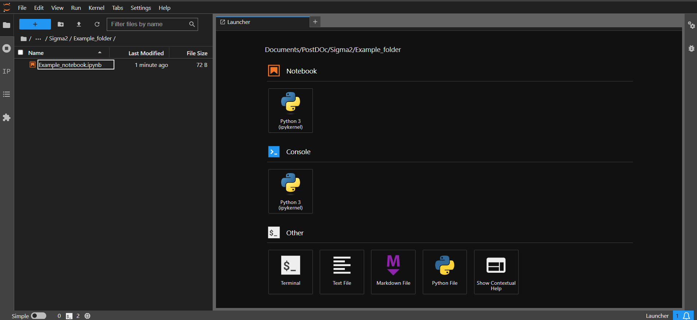

Tutorials
=========

.. _introduction_to_jupyter

Introduction to Jupyter
------------------------

Using SIGMA2 does not require any previous knowledge of python or jupyter notebooks. This section contains some tips and shortcuts to help users who are less experienced with python and jupyter to run SIGMA.

Opening a Notebook
^^^^^^^^^^^^^^^^^^

In your conda command line interface, you can start jupyter lab by running the following:

.. code-block:: bash

   jupyter lab

This should open a browser window with jupyter lab running. It should look like this.

In the left hand panel, you can see a folder structure. In here you can navigate through folders on your computer, into a folder containing the notebook(s) you wish to run.

You can then open one of these notebooks by double clicking it. It should then open to the right of this panel containing the directories.

Running Cells
^^^^^^^^^^^^^

A jupyter notebook is made up of cells. An example is shown here.

.. image:: cells.png
  :width: 400
  :alt: Example of cells in jupyter

A jupyter notebook will typically contain

* Markdown cells. These usually contain text, which is intended to provide information / guidance to the user. They do not impact how the code is run in the notebook.
* Code cells. These contain code, which will be ran by the notebook
* Outputs. These appe

To run a cell, select it with your mouse and press <kbd>Shift</kbd>+<kbd>Enter</kbd>. This will run the cell and advance to the next cell.

Useful Shortcuts
^^^^^^^^^^^^^^^^

Some useful shortcuts for running and using cells in jupyter are:

* <kbd>Shift</kbd>+<kbd>Enter</kbd> will run the current cell and advance to the next cell
* <kbd>Ctrl</kbd>or<kbd>Cmd</kbd>+<kbd>Enter</kbd> will run the current cell without advancing to the next cell
* <kbd>Alt</kbd>+<kbd>Enter</kbd> will run the current cell, and create a new cell beneath the current cell
* Typing part of the name of an object or function, then pressing <kbd>Tab</kbd> will autocomplete it
* After typing a function, pressing <kbd>Shift</kbd>+<kbd>Tab</kbd> will bring up the docstring for the function. This will contain brief information about what the function does, and what arguments it expects.

.. _interactive_sem_tutorial

Interactive SEM Tutorial
------------------------

Introduction
^^^^^^^^^^^^

This tutorial is designed to walk-through the key features of SIGMA2, and demonstrates the workflow that can be used to analyse EDS data with the tools provided.

In general, the philosopy behind the SIGMA workflow is:

#. Reduce the dimensionality of the dataset into a **latent space**.
#. Produce **clusters** by grouping points in the latent space together.
#. Perform Non-negative Matrix Factorisation **(NMF)** on these clusters to determine the constituent phases that make up the sample

Opening the Notebook
^^^^^^^^^^^^^^^^^^^^

Start jupyter lab by running the following in the ``sigma2`` environment in the ``conda`` terminal in the ``SIGMA2`` folder.

.. code-block:: bash

   jupyter lab

A browser window should open, with jupyter lab running. Navigate to the ``Interactive_SEM_tutorial.ipynb`` notebook in the tutorials folder, and open it. 

Importing the Required Packages
^^^^^^^^^^^^^^^^^^^^^^^^^^^^^^^

The first code cell of the notebook should look like:

.. code-block:: python 

   from umap import UMAP # for UMAP latent space projections
   import sys # for relative imports of sigma
   sys.path.insert(0,"..")
   from sigma.utils import normalisation as norm 
   from sigma.utils import visualisation as visual
   from sigma.utils.load import SEMDataset
   from sigma.src.utils import same_seeds
   from sigma.src.dim_reduction import Experiment
   from sigma.models.autoencoder import AutoEncoder
   from sigma.src.segmentation import PixelSegmenter
   from sigma.gui import gui

Running this cell will:

* Import the ``umap`` package which is needed to perform latent space projections
* Import the `sys` package -this is needed to perform "relative imports" of SIGMA2

.. note::
   SIGMA2 is still in development, so for the time being it is imported using relative imports. When you create your own notebooks for analysis, you will need to ensure the relative imports "point" to the correct place - see :doc:`personal` section for more information about using SIGMA for your own data analysis.

